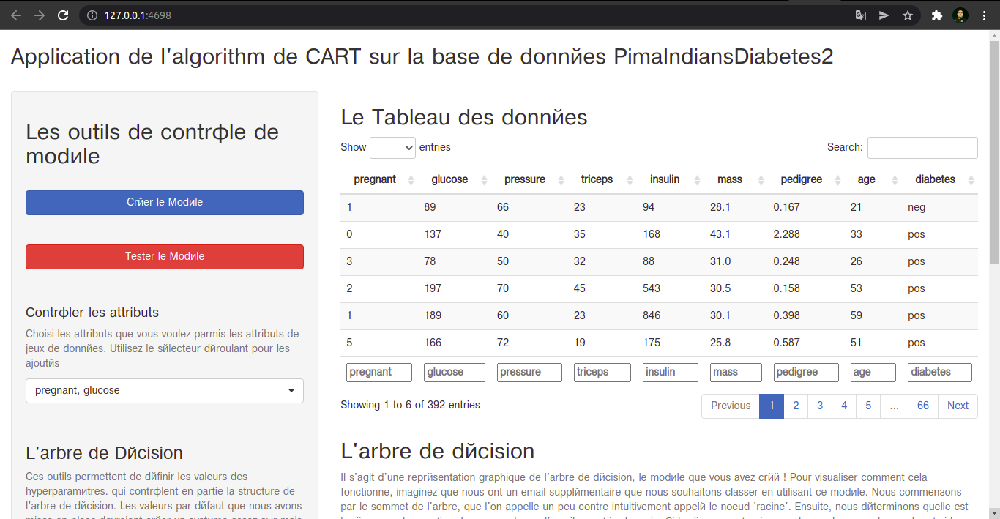
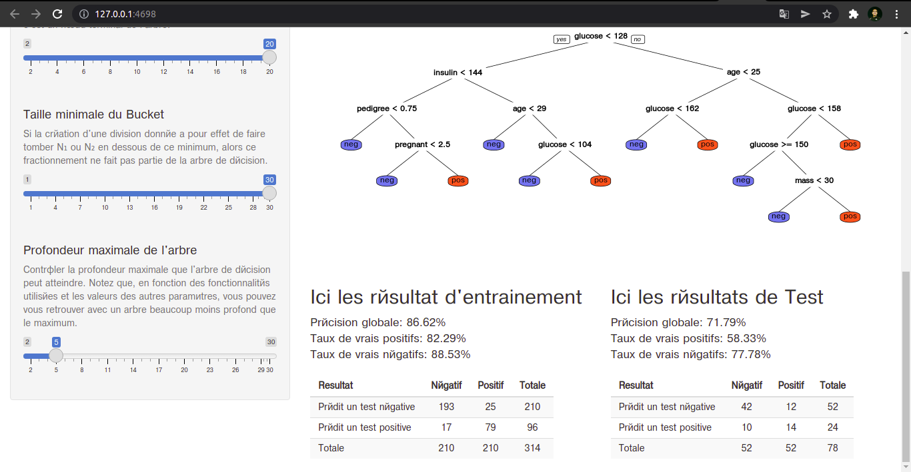

# Decision Tree Shiny App With PimaIndiansDiabetes2
[More about the dataset check here!](https://www.rdocumentation.org/packages/mlbench/versions/2.1-3/topics/PimaIndiansDiabetes)

### Necessary Packages:
+ rpart
+ mlbench
+ shiny
+ shinyWidgets

### How To launch the App
Open the app with R Studio and click Run APP

### Screenshoots

